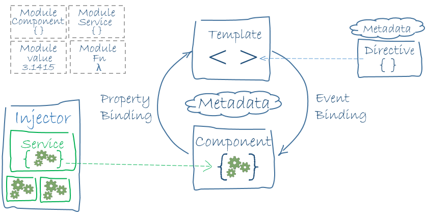
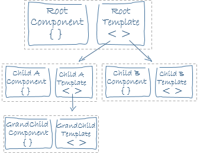
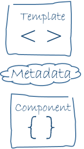
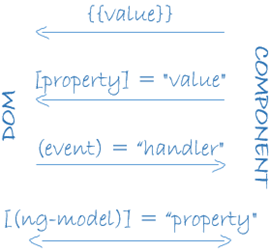
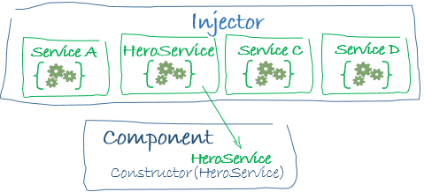

# 基础概念
* data binding (数据绑定)
* master/detail (Master-Detail Application/主-从视图的应用程序(Master-Detail Application))
* dependency injection (依赖注入)
* navigation
* remote data access

> 对于有一定开发经验的人关注数据绑定、主从结构、依赖注入就可以了。
# 基础架构

* Modules 模块
    * 包含一个或者多个组件
    * `class AppComponent {}` 最简单的一个模块
    * 按照约定，根组件的名称为AppComponent
    * 已库的形式(Angular libraries)将多个模块打包输出
* Components 组件
    * 组件内包含一堆现实在屏幕上的内容，我们称之为View
    * 通过实现View内部的API，使用例如Service、生命周期。处理业务逻辑
* Templates
    * 类HTML标签的混合模版。
    * Angular类型标签 ` *ngFor, {{hero.name}}, (click), [hero], <hero-detail>`
    * 
* Metadata
    * 元数据描述告诉Angular如何处理组件Class
    * 用注解`@Component`描述组件
    * 模板，元数据和组件一起描述了一个视图。
    * @Input和@Output是两个比较流行的注释。
* Data binding
    * `<li>{{hero.name}}</li>`
    * `<hero-detail [hero]="selectedHero"></hero-detail>`
    * `<li (click)="selectHero(hero)"></li>`
    * `<input [(ngModel)]="hero.name">` 这个是双向绑定
    * 
    * 每次JS事件周期，angular处理所有数据绑定
        * 是模版与组件之间重要的中间人
        * 也是父子组件重要的中间人
* Directives 指令
    * 组件是指令+模版
    * 组件注解也是指令注解的扩展
    * 另外两种指令， 结构指令 structural、属性指令 attribute
        * 结构指令 structural
            * `<li *ngFor="let hero of heroes"></li>`
            * `<hero-detail *ngIf="selectedHero != null"></hero-detail>`
        * 属性指令 attribute
            * `<input [(ngModel)]="hero.name">`
            * ngModel ngSwitch ngStyle ngClass
            * 自定义类型
* Services
    * 服务是将数值、方法、特性等其他App需要功能的提供者
    * 例如： 日志，数据服务，消息处理，app配置
* Dependency injection 依赖注入
    * 
    * 透过@Component注解，的providers属性，进行注入，angular内部解决了初始化的问题。
    * 组件内部如果已经注入过服务实例，就返回实例，
    * 没有注入服务实例就初始化它。

# official turorial 官网新手教程
[官方推荐学习路径](https://angulardart.dev/guide/learning-angular)

[官网新手教程](https://angulardart.dev/tutorial)

# 其他需要学习的重要组件，后面实操再说
Here is a brief, alphabetical list of other important Angular features and services.

* Forms: Support complex data entry scenarios with HTML-based validation and dirty checking.

* HTTP: Communicate with a server to get data, save data, and invoke server-side actions with an HTTP client.

* Lifecycle hooks: Tap into key moments in the lifetime of a component, from its creation to its destruction, by implementing the lifecycle hook interfaces.

* Pipes: Improve the user experience by transforming values for display.

* Router: Navigate from page to page within the client app and never leave the browser.

* Testing: Write component tests and end-to-end tests for your app.