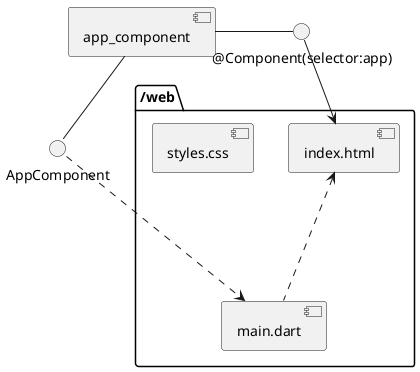

[官网原文](https://angulardart.dev/tutorial)
# 减半儿翻译
## 实现目标
* 用directives实现显示、隐藏列表数据
* 实现一个显示详情的组件component
* 用单向数据绑定，绑定只读数据
* 用双向绑定，实现可编辑字段
* 对组件component绑定点击，键盘等事件
* 用户可以选择列表中的内容，到详细页面编辑
* 用pipes格式化数据
* 使用路由router导航不同的view、components

## 基础项目结构
```text
angular_tour_of_heroes
    lib
        app_component.dart # 根节点在这里
    test
        app_test.          # 测试代码
    web
        index.html         # angular写的标签需要放在body中，算是入口节点吧
        main.dart
        styles.css
    analysis_options.yaml  # dart的静态代码检查规则，帮你挑代码错的工具
    pubspec.yaml           # dart项目配置，等同与node的package.json
```

