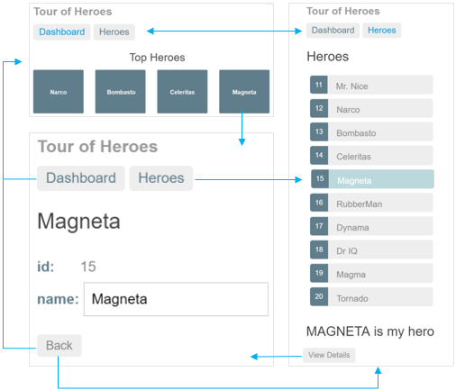

实现
* 导览面板View
* 透过导航切换“Hero”View，根导览View
* 点击其中一项，在跳转到详情View
* 导览面板透过链接，直接到详情

# 设计 与 实现步骤
1. 重构AppComponent,让他只包含导航
2. 列表页面代码重命名为新Class
3. 添加路由
4. 新建一个导览面板
5. 绑定导览面板到导航逻辑

# 要点：
* Angular编译过程中会生成中间代码，路由配置依赖中间代码。所以有些导入很突兀。
    * 例如：import 不存在的文件，`xxxxx.template.dart`
    * 例如：路由过程中提供的工厂方法。 `xxxxxx.xxNgFactory`
    * 生成文件的相对路径与原文件平级，
        * 假设组件class ：aaaa/bbbb/xxxxx.dart
        * 则生成路径为   ：aaaa/bbbb/xxxxx.template.dart
* 导入不存在的中间文件而不报错，是因为在静态检查中配置了忽略中间文件错误
    * `analysis_options.yaml` -> `errors:` -> `uri_has_not_been_generated: ignore`
* 特殊改动：修改web文件夹下代码
    * main.dart 中要添加路由注入代码
    * html添加一段路由的js方法，用来正则路径匹配
* 修改AppComponent的模版加入路由、以及其他配置。
    * `<router-outlet [routes]="Routes.all"></router-outlet>`
    * `directives: [routerDirectives]`
    * `exports: [RoutePaths, Routes]`
* 

# 其他
* 路由是根据业务需要而添加。不是必要操作
